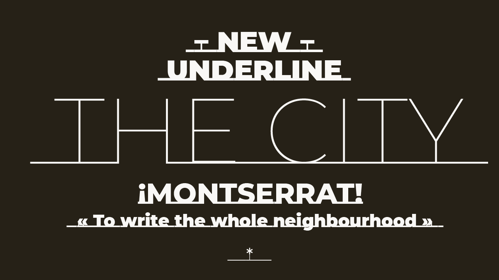
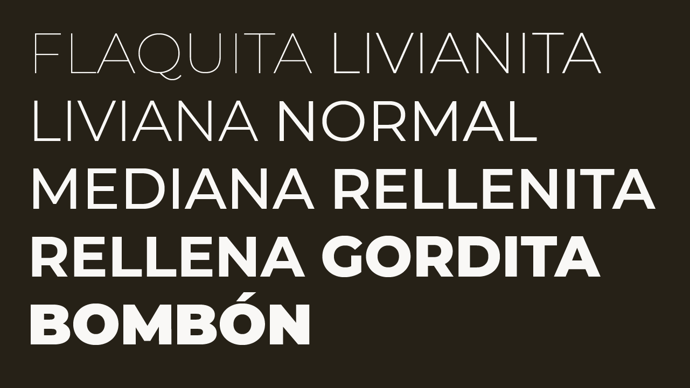
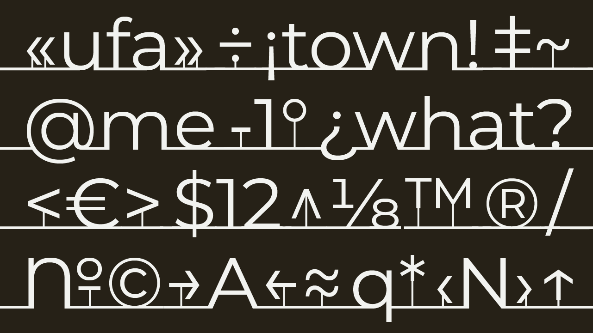

# The Montserrat Font Project

[![][Fontbakery]](https://JulietaUla.github.io/Montserrat/fontbakery/fontbakery-report.html)
[![][Universal]](https://JulietaUla.github.io/Montserrat/fontbakery/fontbakery-report.html)
[![][GF Profile]](https://JulietaUla.github.io/Montserrat/fontbakery/fontbakery-report.html)
[![][Shaping]](https://JulietaUla.github.io/Montserrat/fontbakery/fontbakery-report.html)

[Fontbakery]: https://img.shields.io/endpoint?url=https%3A%2F%2Fraw.githubusercontent.com%2FJulietaUla%2FMontserrat%2Fgh-pages%2Fbadges%2Foverall.json
[GF Profile]: https://img.shields.io/endpoint?url=https%3A%2F%2Fraw.githubusercontent.com%2FJulietaUla%2FMontserrat%2Fgh-pages%2Fbadges%2FGoogleFonts.json
[Outline Correctness]: https://img.shields.io/endpoint?url=https%3A%2F%2Fraw.githubusercontent.com%2FJulietaUla%2FMontserrat%2Fgh-pages%2Fbadges%2FOutlineCorrectnessChecks.json
[Shaping]: https://img.shields.io/endpoint?url=https%3A%2F%2Fraw.githubusercontent.com%2FJulietaUla%2FMontserrat%2Fgh-pages%2Fbadges%2FShapingChecks.json
[Universal]: https://img.shields.io/endpoint?url=https%3A%2F%2Fraw.githubusercontent.com%2FJulietaUla%2FMontserrat%2Fgh-pages%2Fbadges%2FUniversal.json

Julieta Ulanovsky began this project in 2010 while a post-graduate student of typeface design at the FADU, University of Buenos Aires.
She launched it as a Kickstarter project in 2011, in order to complete the first public release and share it with the world through Google Fonts.
In her Kickstarter, she described it like this:

> The old posters and signs in the traditional neighborhood of Buenos Aires called Montserrat inspired me to design a typeface that rescues the beauty of urban typography from the first half of the twentieth century. The goal is to rescue what is in Montserrat and set it free, under a free, libre and open source license, the SIL Open Font License.
>
> As urban development changes this place, it will never return to its original form and loses forever the designs that are so special and unique. To draw the letters, I rely on examples of lettering in the urban space. Each selected example produces its own variants in length, width and height proportions, each adding to the Montserrat family. The old typographies and canopies are irretrievable when they are replaced.
>
> There are other revivals, but those do not stay close to the originals. The letters that inspired this project have work, dedication, care, color, contrast, light and life, day and night! These are the types that make the city look so beautiful.

Since then it has been developed by Julieta in collaboration with several designers.
In 2015, a full set of weights and italics were developed by Julieta in collaboration with Ale Paul, Carolina Giovagnoli, Andrés Torresi, Juan Pablo del Peral and Sol Matas.
In 2017, Jacques Le Bailly reworked the entire Latin design, and in parallel Juan Pablo del Peral and Sol Matas developed the initial Cyrillic extension with review and advise from Maria Doreuli and Alexei Vanyashin.
Technical reviews were made by Lasse Fister, Kalapi GajjarBordawekar and Marc Foley. Special thanks also to Thomas Linard, Valeria Dulitzky, Belén Quirós, and Germán Rozo.

## Building

Fonts are built automatically by GitHub Actions - take a look in the "Actions" tab for the latest build.

If you want to build fonts manually on your own computer:

- `make build` will produce font files.
- `make test` will run [FontBakery](https://github.com/googlefonts/fontbakery)'s quality assurance tests.
- `make proof` will generate HTML proof files.

## License

This Font Software is licensed under the SIL Open Font License, Version 1.1.
This license is copied below, and is also available with a FAQ at
https://openfontlicense.org

## Changelog

### Version 3.100

- Now with four set of figures: tabular lining (default), tabular oldstyle, proportional lining, proportional oldstyle.
- fixed kcommaaccent (ķ) accent positioning (thanks @kalapi).
- Deleted some open paths in .glyphs files.

### Version 4.000

- Updated character-set/language support to Google's Pro glyph-set (https://github.com/google/fonts/tree/master/tools/encodings/GF%202016%20Glyph%20Sets)
- Updated OS/2 winMetrics to Google's latest vertical metrics recommendations (https://groups.google.com/d/msg/googlefonts-discuss/W4PHxnLk3JY/KoMyM2CfAwAJ)
- Added 'useTypoMetrics' flag
- Added OpenType features consistent with character-set expansion

### Version 7.200

- Google commissioned Jacques Le Bailly @fonthausen to do an extensive revision of the latin character set.
- We applied a new weight distribution across the variables.
- Now Montserrat has extended Cyrillic support (GF Cyrillic Pro).
- More detais about migration in https://github.com/JulietaUla/Montserrat/releases/tag/v7.200

### Version 8.000

- Variable font wow includes hand hinting by Mike Duggan
- Added necessary glyphs for Navajo
- Other small glyph / OT fixes

### Version 9.000

- New Subfamily: _Montserrat Underline_ replaces Montserrat Subrayada, and is fully synchronized with Montserrat Normal and their respective Alternates versions.
- Glyph Expansion: Increased from 1968 to 2731 glyphs, including SSA (African), new anchors, diacritics, Cyrillic updates, and additional characters.
- Tooling & Pipeline Enhancements: Updated to latest gftools, added Cairo, reimported font hinting, and cleaned up scripts.
- Spacing & Kerning Fixes: Improved interpolation, character spacing, kerning pairs, and width matching across styles.
- Miscellaneous Fixes: Case-swapping fixes, remapped fonts, updated Font Info, and cleaned source files.

## Known Issues

**Variable font display issues in Adobe apps:** Variable fonts may not display correctly in certain versions of Adobe CC apps. This behavior varies between different versions. For a more consistent experience, we recommend using the static font files instead. [More info](https://github.com/google/fonts/pull/8281#issuecomment-2402303242).

**Bolder glyph variations:** There are known issues with the appearance of some glyphs in bolder weights. This is due to limitations in fontmake, the tool used to generate the fonts, and is under investigation.
[More details here.](https://github.com/google/fonts/pull/8281#issuecomment-2419002841)
